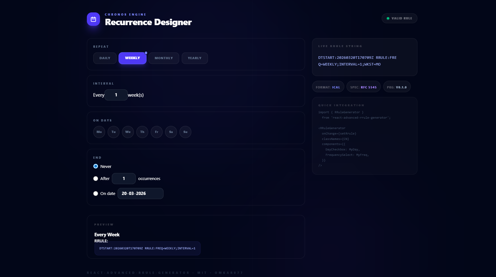

# Chronos Engine - RRule Generator Test App

This project demonstrates the powerful customization capabilities of the [react-advanced-rrule-generator](https://www.npmjs.com/package/react-advanced-rrule-generator) package.

## Preview

## How to Customize

Transformed the base package into a premium SaaS-style dashboard ("Chronos Engine") by:

1.  **Utilizing Tailwind v4**: Leveraging the latest Tailwind CSS v4 features for a modern design system.
2.  **Custom Sub-Components**: Overriding the package's internal components (`FrequencySelect`, `DayCheckbox`) with bespoke React components.
3.  **Advanced Layout**: Implementing a professional two-panel grid system with a dark-themed live preview.
4.  **Premium Aesthetics**: Applying a refined Geist-font typography, sophisticated Slate/Indigo palette, and subtle glassmorphism.

## Getting Started

1.  Install dependencies: `npm install`
2.  Run the test environment: `npm run dev`
3.  Open [http://localhost:5173/](http://localhost:5173/) (or the port shown in your terminal).

---

Powered by [react-advanced-rrule-generator](https://www.npmjs.com/package/react-advanced-rrule-generator)
